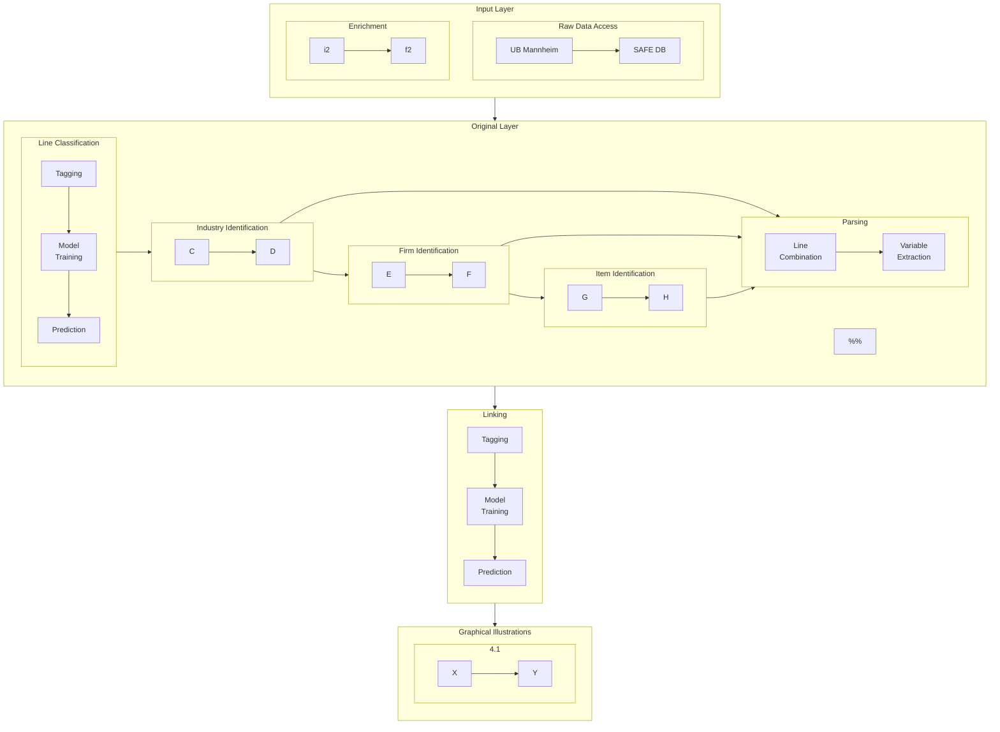

# Table of contents
1. [Purpose](#purpose)
2. [GitHub](#github)
3. [Schema](#schema)
    1. [Database Layers](#schema_layers)
    2. [The Layers' Tables](#schema_tables)
    3. [Variable Definitions](#schema_definitions)
4. [Access](#access)

## Purpose 

This repository hosts the code and documentation associated with the SAFE historical firm database for Germany. It further provides information on how to formally [access the database](#access).

## GitHub Structure 
Note that the repository relies on GitHub submodules. Submodules can either be external stand-alone projects or repositories established only for creating the SAFE database. Moreover, running the file 

>main.py.

builds all layers of the database, including descriptive statistics and graphical illustrations of the layers, from scratch. The Graph below illustrates the logic of the process. Each gray rectangular represents a submodule.

## Data Model / Database Design 

### Database Layers 

embed graph here

### The Layers' Tables 

embed graphs here

### Variable Definitions 

## Access 

Please contact [Dennis Gram](mailto:gram@safe-frankfurt.de), the head of the SAFE data center, for access
