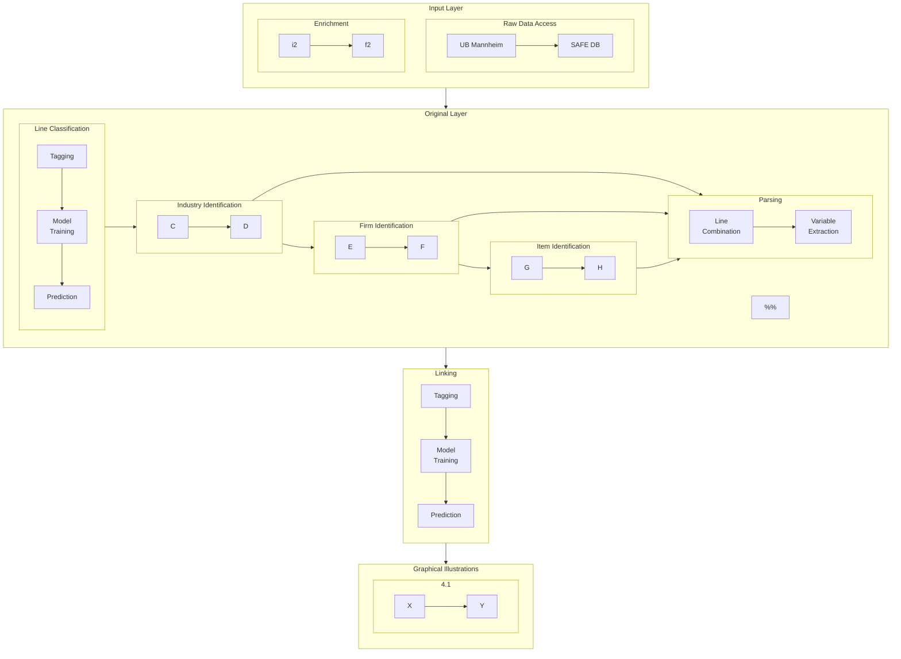

# Table of contents
1. [Purpose](#purpose)
2. [GitHub](#github)
3. [Schema](#schema)
    1. [Database Layers](#schema_layers)
    2. [The Layers' Tables](#schema_tables)
    3. [Variable Definitions](#schema_definitions)
4. [Access](#access)

## Purpose 

This repository hosts the code and documentation associated with the SAFE historical firm database for Germany. It further provides information on how to formally [access the database](#access).

Eventually, the aim is to recursively clone this reposititory (with its associated submodules for the singles steps), allowing to execute the full funcationality, building the database (see the section [GitHub Structure](#github) for further information).

Morover, until the completion of all steps, this repository serves as project management tool to [assign](#tasks) and track the tasks associated with the individual contributers. If questions arise at any point, please open a threat in GitHubs's [Issues](https://github.com/maliedvp/safe_hdb/issues) section.

## GitHub Structure 

This repository relies on GitHub submodules. Submodules can either be external stand-alone projects or repositories established only for creating the SAFE database.

Eventually, running the file 

>__main__.py.

builds all layers of the database, including descriptive statistics and graphical illustrations of the layers, from scratch. The Graph below illustrates the logic of the process. Each gray rectangular represents a submodule.

## Data Model / Database Design 

### Database Layers 

embed graph here

### The Layers' Tables 

embed graphs here

### Variable Definitions 

## Access 

Please contact [Dennis Gram](mailto:gram@safe-frankfurt.de), the head of the SAFE data center, for access

---

# Tasks 

## Ina

### 1. LLM zur Extraktion von Personen-Informationen

- **Hochladen des aktuellen Modells auf Huggingface.**  
- **Bereitstellung eines Scripts zur Verwendung des hochgeladenen Modells.**
- **Deadline:** 13.12.2024

### 2. Anpassung/Erstellung der GitHub-Repositories `safe_hdb_training` & `safe_hdb_originallayer`

- Anfertigung und Anpassung der Repositories für den Zeitraum ab Volume 37.  
- **Ziel:** Die produzierten Daten sollen dieselbe Struktur wie bisher haben, sodass alle nachgelagerten Prozesse (z. B. `safe_hdb_derivedlayer` & `safe_hdb_combination`) unverändert bleiben können.
- **Ergebnis:** Ende September 2024 soll eine vollständige Datenbank von 1896 bis 1945 vorliegen.
- **Deadline:** 30.09.2024

### 3. Tabellenverarbeitung

#### Schritt 1: Eliminierung von Tabellenzeilen

- **Implementiere in `safe_hdb_originallayer` eine Funktion zur Eliminierung von Lines, die Teil einer Tabelle sind.**  
  Dafür sind folgende Schritte notwendig:
  1. **Graphische Identifikation von Tabellen**, also deren geographischen Bereiche.
  2. **Mapping von Lines**, die sich in diesen geographischen Bereichen befinden.
  3. **Droppen dieser Lines** aus den DataFrames.

- Diese Funktionalität soll **vor Beginn der eigentlichen Operationen in `__main__.py`** (aktuelle Line 25, `#CONTENT - LINES`) aufgerufen werden. Dadurch konzentrieren sich alle nachfolgenden Operationen ausschließlich auf Nicht-Tabellen-Lines.

- **Arbeit mit Pull-Requests** auf der `safe_hdb_originallayer`-Repository.

#### Schritt 2: Konvertierung von Tabellen

- **Erstellung einer Methode zum Konvertieren von Tabellen** (primär Bilanzen und Gewinn- & Verlustrechnungen).

    - **Ziel:** Tranformation der Inhalte der Tabellen in ein Textformat wie in `derived_202211.items`.  
  
    **Beispiel:** `Bilanz am 31. Dez. 1920: Aktiva: Bergwerksberechtsame 12 817 732, [...] – Passiva: Aktien-Kapital 45 000 000, [...] Vortrag 253 600. Sa. M. 169 697 666.

    - **Beachte:** Diese Konvertierung muss folgende Attribute mit den korrekten Werten versehen:

        - `item_id`
        - `item_ordinality` (100X)
        - `pdf_page_num_range`
        - `company_id`
        - `item_rank`
        - `timestamp`

- **Deadline:** 30.09.2024

---

# Hiwi 1

Adjust the `mermaid` illustration in this README [above](#github) given the current code structure.
